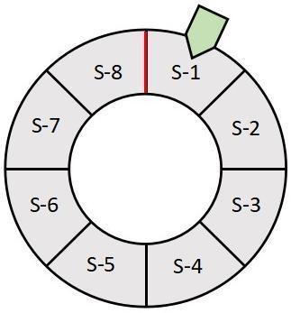

# react-segmento-pilot-js

  This project aims to implement a `segment-chain-pattern`, which serves as a foundation for any application requiring a unidirectional system lifecycle mechanism. The illustration below depicts the pattern as a wheel divided into multiple segments, with each segment encapsulating operations corresponding to a specific lifecycle state. The green arrow indicates the entry point to the pattern, pointing to the current segment. Depending on the current lifecycle state value, the operation associated with the corresponding segment will be executed.

  

