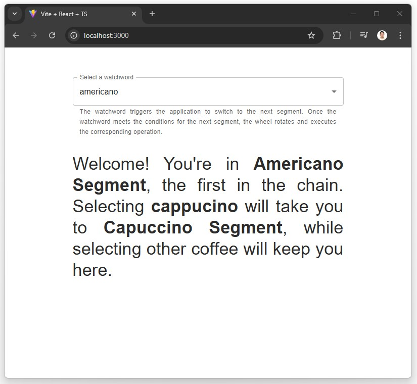

# react-segmento-pilot-js

  This project aims to implement a `segment-chain-pattern`, which serves as a foundation for any application requiring a unidirectional system lifecycle mechanism. The illustration below depicts the pattern as a wheel divided into multiple segments, with each segment encapsulating operations corresponding to a specific lifecycle state. The green arrow indicates the entry point to the pattern, pointing to the current segment. Depending on the current lifecycle state value, the operation associated with the corresponding segment will be executed.

Oct 28, 2024:
As of now, the app is ready for demo. Please feel free to explore the code, and don't hesitate to reach out with any questions or suggestions. Cheers!

  

### Running the app:

`yarn dev` will launch the app to `localhost:3000`.

  

